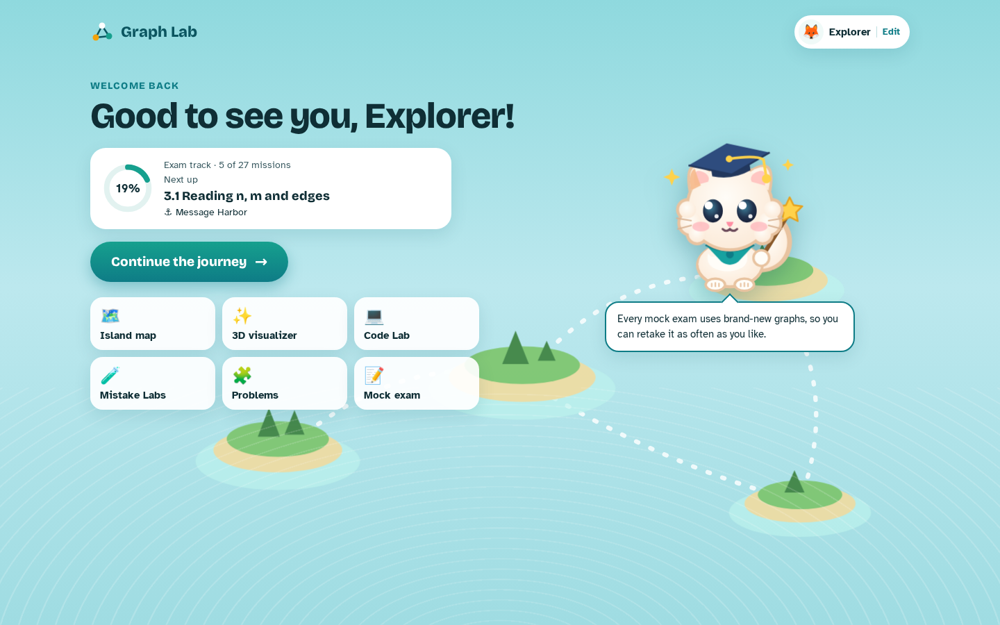
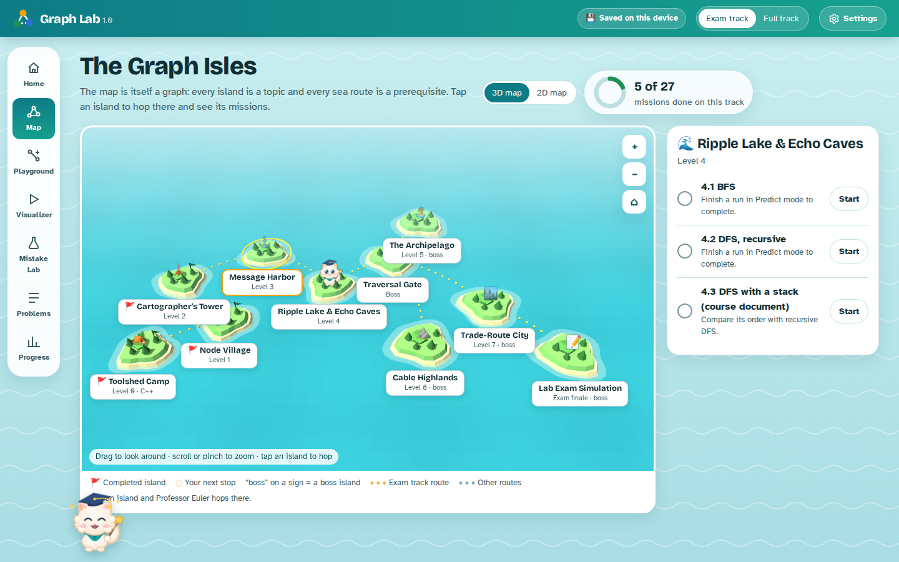
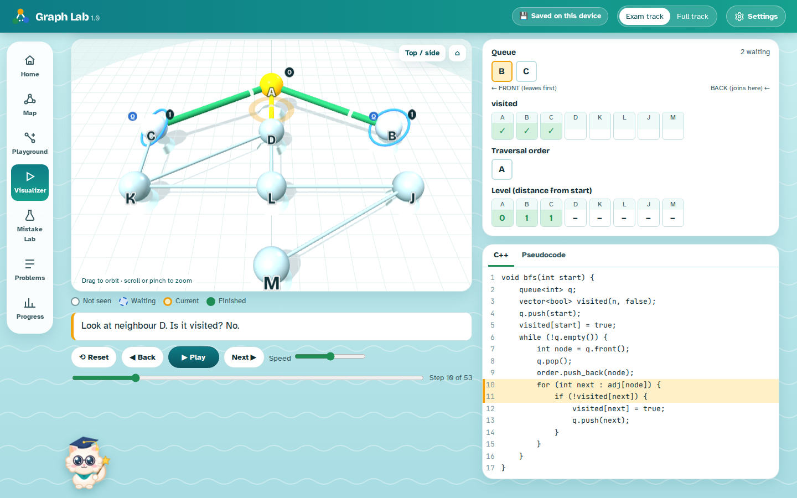
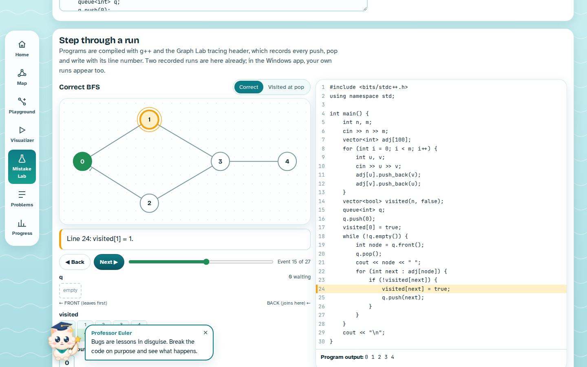
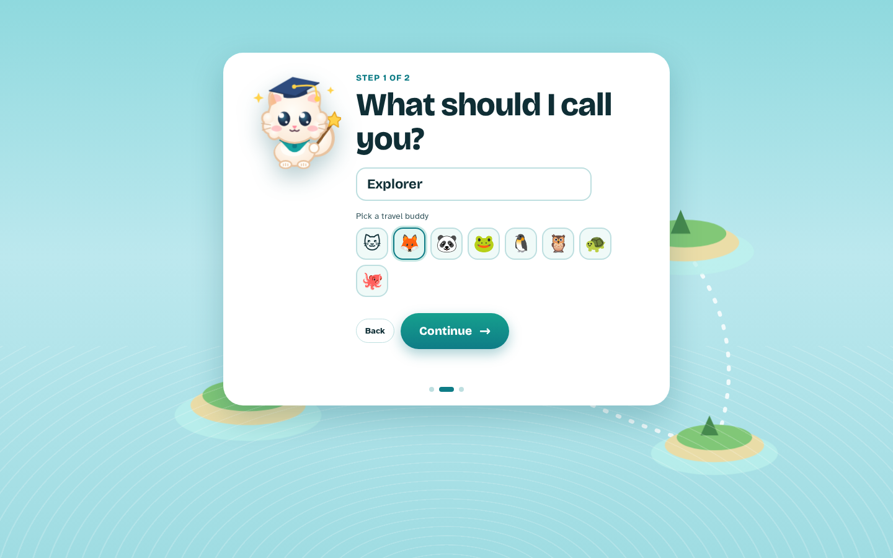

# 🏝️ Graph Lab

**Learn graph algorithms one island at a time: 3D visualizations, real C++, and an offline compiler built in.**

Graph Lab turns graph algorithms into an archipelago. Every island is a topic, every sea route is a prerequisite, and Professor Euler, a little cat in a graduation cap, guides you from island to island. Watch each algorithm run step by step in 3D, predict its next move, break code on purpose in the Mistake Labs, then write your own C++ and watch it drive the graph line by line.

### [📥 Download for Windows](https://github.com/Nemasis070910/Graph-Lab/releases/latest)

## ✨ Features

- **3D island map** with two paths: an **Exam track** (27 missions) and a **Full track** (47 missions, including advanced topics)
- **20+ algorithms visualized in 3D** (with a 2D view too): BFS, DFS, connected components, flood fill, cycle detection, bipartite check, topological sort, Kahn's algorithm, Dijkstra, Bellman-Ford, Floyd-Warshall, DSU, Kruskal, Prim, Kosaraju's SCC, and Tarjan's bridges and articulation points
- **Predict mode**: the app pauses and asks what happens next before showing you
- **7 Mistake Labs** built around common bugs: marking visited at the wrong time, forgetting disconnected graphs, Dijkstra on a negative edge, `>=` instead of `>` in the bridge test, and more
- **Code Lab**: write ordinary C++, compile it with the **GCC compiler bundled inside the app**, and watch your own code drive the graph line by line
- **Problem library** of 50+ classic problems from LeetCode, Codeforces, CodeChef and CSES, with direct links and hidden topics
- **Mock lab exam and final challenge**, with freshly generated graphs on every attempt
- **Learner profiles**: everyone adds their own name and gets separate progress, saved on the PC, with export and import

| 3D island map | 3D visualizer |
|---|---|
|  |  |

| Code Lab | Welcome |
|---|---|
|  |  |

## 🚀 Getting started (Windows)

1. Download `GraphLab-1.1-win64.zip` from [Releases](https://github.com/Nemasis070910/Graph-Lab/releases/latest).
2. Right-click the zip, choose **Extract All…**, and open the extracted folder.
3. Double-click **Graph Lab.exe**.
4. If Windows shows "Windows protected your PC", click **More info** → **Run anyway** (the app isn't code-signed yet).

No installation, no internet connection and no separate compiler are needed. Progress is saved per learner in `%APPDATA%\Graph Lab\`.

## 🛠️ Tech stack

| Part | Technology |
|---|---|
| Interface | HTML, CSS, JavaScript |
| 3D graphics | three.js (2D views in SVG) |
| Desktop app | Electron |
| Compiler | GCC 16.2 (MinGW-w64, from w64devkit 2.10.0), bundled |
| Code tracing | A custom C++23 header (`app/graphlab.h`) |
| Testing | Automated browser test suites and a desktop self-test |

### How the Code Lab works

When you press **Compile and run**, the app saves your code to a temporary folder and compiles it with the bundled g++ (`-std=c++23 -static`). It then runs the program with a 4-second time limit, passing your input through a file the way online judges do. The header `graphlab.h` is automatically included and swaps `vector`, `queue` and `stack` for versions that record every push, pop and write with its line number, so your code needs no changes. The app replays those records as an animation on the graph.

## 🧑‍💻 Building from source

See [BUILD.md](BUILD.md). In short: install Node.js, copy the `mingw` folder from the release zip next to `app/`, then run `npm install` and `npm start` inside `app/` (or `npm run dist` for an installer).

## 📚 Course information

Built while studying graphs at **Khulna University**, Computer Science & Engineering Discipline:

- Data Structures – 0714 02 CSE 2101
- Advanced Programming Laboratory – 0714 02 CSE 2100

## 📄 Third-party software

- [three.js](https://threejs.org/) – MIT License
- [Electron](https://www.electronjs.org/) – MIT License (Chromium licenses included in the release)
- [GCC](https://gcc.gnu.org/) and GNU binutils – GNU GPL; complete source published with [w64devkit 2.10.0](https://github.com/skeeto/w64devkit/releases/tag/v2.10.0)
- [MinGW-w64](https://www.mingw-w64.org/) runtime – see `COPYING.MinGW-w64-runtime.txt` in the release
